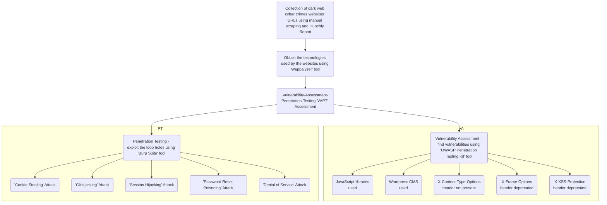

# A Comprehensive VAPT Assessment of Dark Web Cyber Crimes Websites

# Methodology Block Diagram

```mermaid
graph TD;

    Collection(Collection of dark web cyber crimes websites' URLs using manual scraping and Hunchly Report)
    WebTechnologies(Obtain the technologies used by the websites using 'Wappalyzer' tool)
    PerformAssessment(Vulnerability-Assessment-Penetration-Testing 'VAPT' Assessment )
    VulnerabilityAssessment(Vulnerability Assessment - find vulnerabilities using 'OWASP Penetration Testing Kit' tool)
    PenetrationTesting(Penetration Testing - exploit the loop holes using 'Burp Suite' tool)

    subgraph VA
        VulnerabilityJS(JavaScript libraries <br>used)
        VulnerabilityWP(Wordpress CMS <br>used)
        VulnerabilityXContent(X-Content-Type-Options <br>header not present)
        VulnerabilityXFrame(X-Frame-Options <br>header deprecated)
        VulnerabilityXXSS(X-XSS-Protection <br>header deprecated)

        VulnerabilityAssessment-->VulnerabilityJS
        VulnerabilityAssessment-->VulnerabilityWP
        VulnerabilityAssessment-->VulnerabilityXContent
        VulnerabilityAssessment-->VulnerabilityXFrame
        VulnerabilityAssessment-->VulnerabilityXXSS
    end

    subgraph PT
        CookieStealingAttack('Cookie Stealing' Attack)
        ClickjackingAttack('Clickjacking' Attack)
        SesionHijacking('Session Hijacking' Attack)
        PasswordResetPoisoningAttack('Password Reset Poisoning' Attack)
        DoSAttack('Denial of Service' Attack)

        PenetrationTesting-->CookieStealingAttack
        PenetrationTesting-->ClickjackingAttack
        PenetrationTesting-->SesionHijacking
        PenetrationTesting-->PasswordResetPoisoningAttack
        PenetrationTesting-->DoSAttack
    end


    Collection --> WebTechnologies
    WebTechnologies-->PerformAssessment
    PerformAssessment-->VulnerabilityAssessment
    PerformAssessment-->PenetrationTesting

```