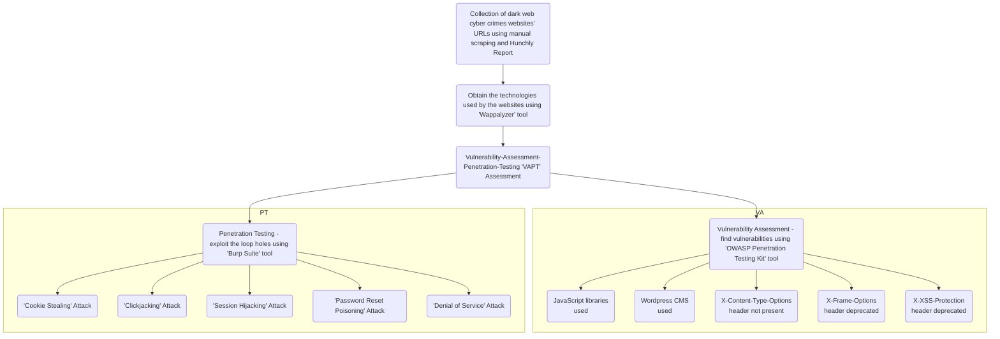

# A-Comprehensive-VAPT-Assessement-of-Dark-Web-Cyber-Crimes-Websites

First, the dark web cyber crimes websites are collected using manual scraping and Hunchly reports. Then, the web technologies used by the collected websites are fetched using the Wappalyzer tool. Observing the web technologies, vulnerabilities are found using the OWASP Penetration Testing Kit tool. For some of the vulnrabilities found, exploits are strategized and attacks are performed.

Vulnerabilities found are:-

1. JavaScript Libraries are used in some websites - Found using Wappalyzer tool. XSS vulnerabilities may exist.
2. WordPress is used in some websites - Found using Wappalyzer tool. XSS vulnerabilities may exist.
3. X-Frame-Options header is deprecated - Found using OWASP Penetration Testing Kit tool. Clickjacking exploitation may be performed.
4. X-Content-Type-Options header is not found - Found using OWASP Penetration Testing Kit tool. XSS exploitation may be performed.
5. X-XSS-Protection header is deprecated - Found using OWASP Penetration Testing Kit tool. XSS exploitation may be performed.

Penetration testing is performed using Burp Suite tool. The attacks performed are:- 

1. 'Cookie Stealing' Attack - performed by intercepting the request and fetching the cookie.
2. 'Clickjacking' Attack - performed by executing the clickjacking code, obtained from Burp Suite Clickbandit tool, in the Console of the Inspect tool of the webpage.
3. 'Session Hijacking' Attack - performed by intercepting the request of a website, obtaining the cookie, and replacing the cookie of another session with the previously obtained cookie to gain access.
4. 'Password Reset Poisoning' Attack - performed by intercepting the request of a website, obtaining the cookie, and replacing the cookie of password reset of another user in the previously intercepted request of genuine user.
5. 'Denial of Service' Attack - measuring the increase in CPU and memory by sending requests multiple time.
